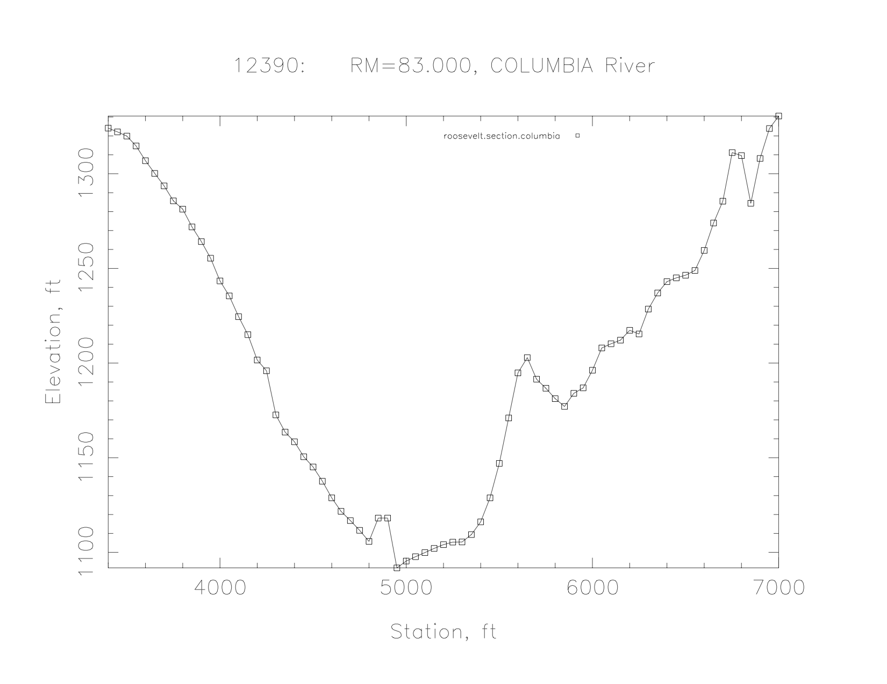

# MASS1 Cross Section File

Cross section data records consist of multiple lines.  The information
required will vary depending on cross section type.  In all
cross records, the first field of the first line is an integer cross
section identifier and the second field is the cross section type.  


## Prismatic Cross Sections


### Rectangular

A rectangular cross section is specified by two lines. The first line
contains the section identifier and type (1). The second line contains
the section width and must be terminated with a `/`.  Here is an
example rectangular cross section:
```
150     1         / Rectangular Section
 100.0            /
```

### Rectangular w/ Flood Plain

This is a compound section combining a rectangular main section with a
flood plain.  

In the example below, the base rectangular section is 3000.0 units
wide and 10.0 units deep.  The flood plain is 6000 units wide.  

```
3       2           /
10.0 3000.0 6000.0  /
```

### Trapezoidal

A trapezoidal cross section is specified with two lines.  The first
contains the section identifier and type (3).  In the example below,
the base width is 32.8 feet and the side slope is 1/2.0.  

```
100     3         / Trapezoidal Section
 32.8      2.0    /
```

### Triangular

A triangular cross section is also specified by two lines.  The first
contains the section identifier and type (4).  The second contains the
run for 1 unit of rise in the channel side slope.  In the example below,
the channel side slope is 1/2.0.

```
110     4         / Triangular Section
  2.0             /
```

### Rounded Triangular

A triangular section with the bottom rounded to a circular with
specified radius *r*.  It's specified with by two lines. The first
contains the section identifier and type (14).  The second contains
the side slope run, as in the triangular section, and the bottom
radius.  The example below is the same as the triangular section
example, but with a circular bottom with radius of 4.  

```
220    14         / Rounded Triangular Section
  2.0   4.0       / 
```

### Triangular Bottom

This section is a triangular section with vertical walls at maximum
width. The first contains the section identifier and type (24).  The
second contains the side slope run, as in the triangular section, and
the maximum width.  The example below is the same as the triangular
section example, but with a maximum width of 10.0.
```
240     4         / Triangular Bottom Section
  2.0  10.0       /
```

### Parabolic

The bottom elevation of a parabolic cross section is defined as *y =
kx<sup>2</sup>*, where *x* is the distance from the cross section
center.  A parabolic cross section is also specified by two lines. The first
contains the section identifier and type (6).  The second contains
only the factor *k*.  In the example below, *k* is 0.0625. The section
would have a top width of 8 with a depth of 1.  

```
120     6         / Parabolic Section
  0.0625          /
```

## General Cross Section

General cross sections have a type of `50`.  The first line contains
the section identifier, the type (50), and the vertical step at which
cross section properties (area, hydraulic radius, etc.) are
pre-calculated.  
A general cross section example from Lake Roosevelt is shown below.
It was generated by the `scripts/cross-section/CHARIMAview.pl`
script. 


As it looks in the cross section file:
```
12250   50       1.0   RM=79.500, COLUMBIA River
    1  127
    1300.0    1382.6    1350.0    1371.8    1400.0    1362.2    1450.0    1349.1
    1500.0    1337.5    1550.0    1312.9    1600.0    1285.1    1650.0    1258.2
    1700.0    1232.8    1750.0    1212.4    1800.0    1186.9    1850.0    1172.7
    1900.0    1164.3    1950.0    1161.0    2000.0    1158.1    2050.0    1156.8
    2100.0    1156.7    2150.0    1155.0    2200.0    1152.4    2250.0    1150.8
    2300.0    1149.0    2350.0    1145.3    2400.0    1144.3    2450.0    1139.8
    2500.0    1137.6    2550.0    1136.8    2600.0    1136.4    2650.0    1136.4
    2700.0    1135.7    2750.0    1135.3    2800.0    1135.5    2850.0    1135.3
    2900.0    1135.4    2950.0    1135.0    3000.0    1132.7    3050.0    1134.0
    3100.0    1133.0    3150.0    1132.2    3200.0    1131.3    3250.0    1130.9
    3300.0    1127.7    3350.0    1123.8    3400.0    1113.6    3450.0    1104.5
    3500.0    1101.0    3550.0    1100.6    3600.0    1102.9    3650.0    1107.0
    3700.0    1112.7    3750.0    1123.1    3800.0    1134.4    3850.0    1144.5
    3900.0    1157.4    3950.0    1163.7    4000.0    1164.1    4050.0    1162.4
    4100.0    1154.5    4150.0    1148.5    4200.0    1138.3    4250.0    1126.7
    4300.0    1113.3    4350.0    1102.3    4400.0    1093.4    4450.0    1082.2
    4500.0    1070.9    4550.0    1066.1    4600.0    1066.5    4650.0    1066.7
    4700.0    1065.6    4750.0    1065.2    4800.0    1065.6    4850.0    1067.7
    4900.0    1072.5    4950.0    1086.1    5000.0    1087.7    5050.0    1084.5
    5100.0    1084.1    5150.0    1089.0    5200.0    1091.8    5250.0    1100.4
    5300.0    1114.1    5350.0    1113.6    5400.0    1106.1    5450.0    1104.1
    5500.0    1105.9    5550.0    1105.9    5600.0    1106.0    5650.0    1108.4
    5700.0    1110.5    5750.0    1116.3    5800.0    1122.9    5850.0    1136.5
    5900.0    1148.9    5950.0    1160.1    6000.0    1172.1    6050.0    1181.9
    6100.0    1190.2    6150.0    1194.7    6200.0    1194.8    6250.0    1191.3
    6300.0    1194.8    6350.0    1204.3    6400.0    1216.4    6450.0    1222.7
    6500.0    1232.5    6550.0    1244.7    6600.0    1257.6    6650.0    1274.0
    6700.0    1284.3    6750.0    1308.8    6800.0    1357.8    6850.0    1353.6
    6900.0    1380.7    6950.0    1391.4    7000.0    1405.1    7050.0    1415.5
    7100.0    1404.5    7150.0    1388.1    7200.0    1366.9    7250.0    1330.9
    7300.0    1286.5    7350.0    1311.0    7400.0    1346.2    7450.0    1364.2
    7500.0    1381.0    7550.0    1392.0    7600.0    1408.5 /
```
Note the `RM=79.500, COLUMBIA River` on the first line is not
used by MASS1, but is documentation added and used by [cross section
handling scripts](../scripts/cross-section/README.md). 
